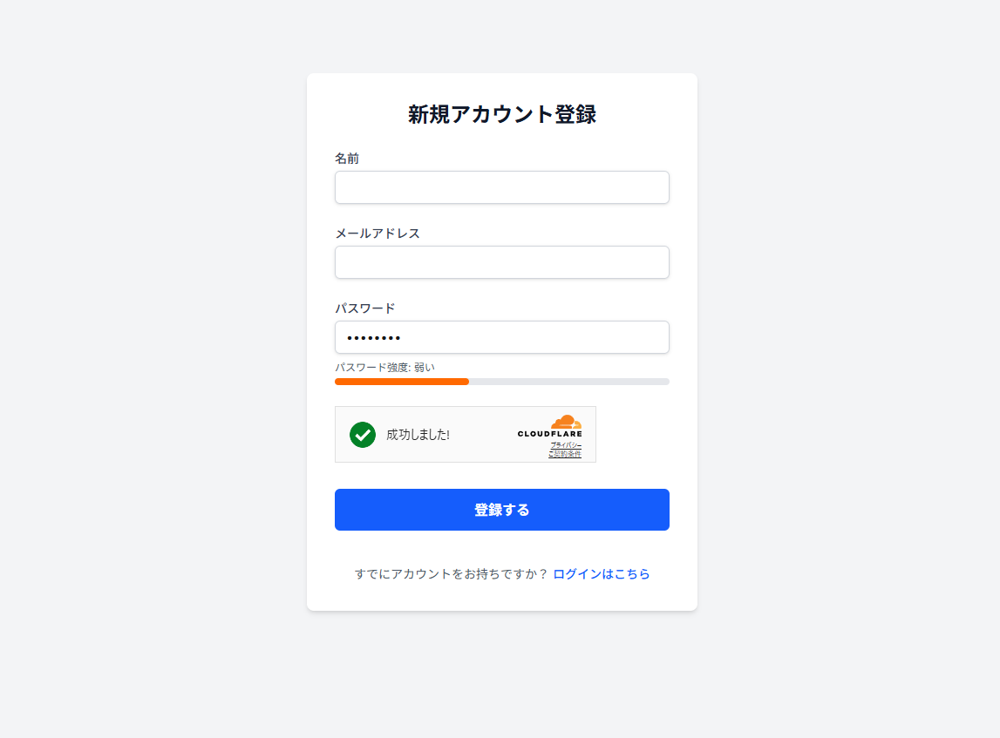
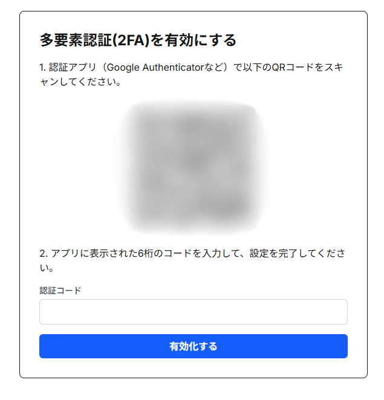
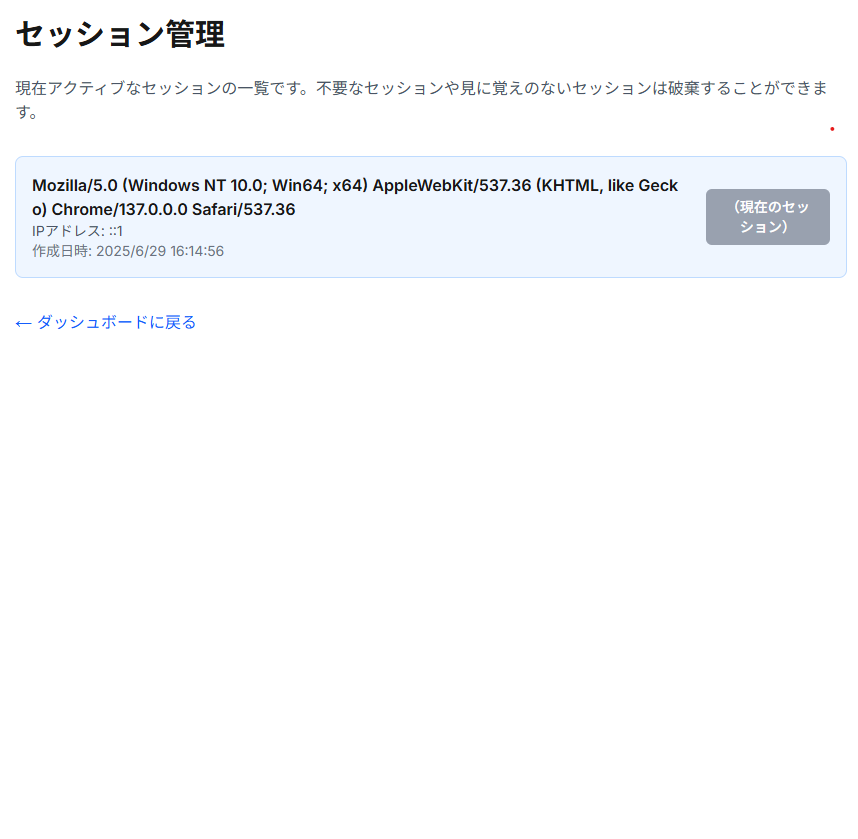

# Login-Test
Supabase Databaseを用いて、セキュアなログインシステムを実装する

## 概要
このプロジェクトは、Next.jsとSupabaseを使用して、セッションベースの認証システムを実装したものです。ユーザーは新規登録、ログイン、2段階認証を通じてセキュアにログインできます。ダッシュボードでは、ユーザー情報の表示とログアウト機能が提供されます。

## 技術スタック
- Next.js
- Supabase
- Prisma
- Zod: ユーザー情報のバリデーション
- bcrypt: パスワードハッシュ化
- otplib: 2段階認証
- Cloudflare Turnstile: CAPTCHAによるボット対策
- Tailwind CSS: スタイリング

## 特徴

### ユーザー登録

安全で使いやすい新規登録フローを提供します。

-   **入力値の検証:** Zod を用いて、メールアドレスの形式やパスワードの最低文字数などのバリデーションをサーバーサイドで厳格に行います。
-   **パスワード強度インジケーター:** ユーザーがパスワードを入力する際、大文字・小文字・数字・記号の使用状況をリアルタイムで分析し、その強度をバーで視覚的に表示します。
-   **ボット対策:** Cloudflare Turnstile を導入し、悪意のあるボットによる自動登録を防止します。
-   **ログイン済みユーザーの保護:** ログイン済みのユーザーが登録ページにアクセスした場合、自動的にダッシュボードへリダイレクトします。



### ログイン & 2要素認証 (2FA)

-   **セッションベース認証:** メールアドレスとパスワードによる標準的なログイン機能を提供します。
-   **2要素認証 (TOPT):** セキュリティを強化するため、Google Authenticatorなどの認証アプリと連携した2要素認証（2FA）を設定できます。
    -   QRコードをスキャンするだけで簡単に有効化できます。
    -   認証コードの生成と検証には `otplib` を使用しています。
    -   一度使用したリカバリーコードは無効化され、安全性が保たれます。



### ダッシュボードとセキュリティ管理

ログイン後のユーザーは、専用のダッシュボードでアカウント情報を管理できます。

-   **アカウント情報の表示:** 登録されているユーザー名やメールアドレスを確認できます。
-   **セッション管理:** 現在アクティブなセッション（ログインしている端末やブラウザ）の一覧を表示します。身に覚えのないセッションを個別に強制ログアウトさせることが可能です。
-   **ログアウト:** 現在のセッションを安全に終了します。



## 強み
- **Cloudflare Turnstileを使用したCAPTCHAによるボット対策**: その他のCAPTCHAサービスと比較して、ユーザーに要求される操作が少なく、ユーザーフレンドリーな体験を提供します。
- **2段階認証の実装**: セキュリティを強化するために、2段階認証を実装しています。ユーザーはログイン時に2FAコードを入力することで、セキュリティを向上させることができます。
- **セッションの一括管理**: ダッシュボードでは、ユーザーのセッションを一覧表示し、必要に応じてセッションを無効化することができます。これにより、ユーザーはセキュリティを強化し、不要なセッションを管理することができます。

## 導入方法

1.  リポジトリをクローンします。
2.  依存関係をインストールします。
    ```bash
    npm install
    ```
3.  `.env.local` ファイルを作成し、Cloudflare Turnstileのキーを設定します。
    ```env
    NEXT_PUBLIC_TURNSTILE_SITE_KEY="Your_Site_Key"
    TURNSTILE_SECRET_KEY="Your_Secret_Key"
    ```
4.  Prismaでデータベースをマイグレートします。
    ```bash
    npx prisma migrate dev
    ```
5.  開発サーバーを起動します。
    ```bash
    npm run dev
    ```

